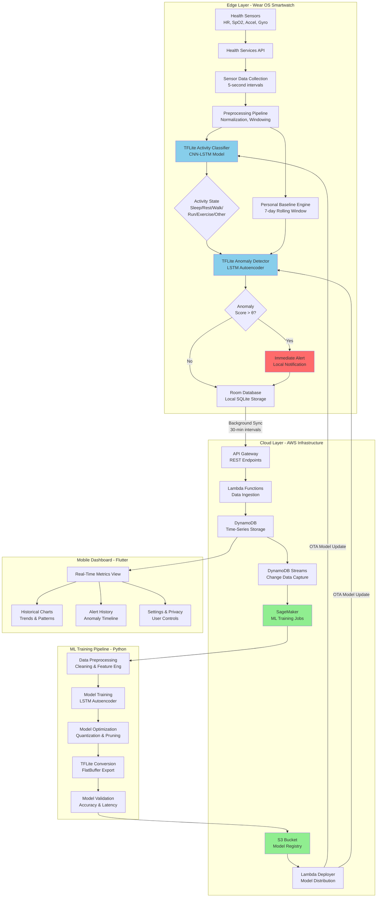

# Chapter 3: System Architecture

## 3.1 Overview of System Architecture

The proposed Real-Time Health Monitoring System employs a hybrid edge-cloud architecture that strategically distributes computational responsibilities across four primary components: (1) the Wear OS smartwatch executing edge intelligence, (2) the AWS cloud infrastructure providing scalable backend services and advanced ML training, (3) the ML training pipeline for model development and optimization, and (4) the Flutter mobile dashboard for comprehensive data visualization and user interaction.

The architecture is designed according to several key principles:

- **Edge-First Processing:** All time-critical operations (sensor data collection, activity classification, anomaly detection, immediate alerting) execute on the Wear OS device to minimize latency and maximize privacy.
- **Cloud Enhancement:** Computationally intensive operations (deep learning model training, long-term data analytics, population-level insights) leverage cloud resources.
- **Graceful Degradation:** The system maintains core functionality (monitoring and alerting) even during network outages; cloud connectivity enhances but does not gate primary features.
- **Battery Optimization:** Aggressive power management through adaptive sensor sampling, batched network transmission, and efficient on-device ML inference.
- **Privacy Preservation:** Raw health data remains on-device by default; only processed insights and user-consented data transmit to the cloud.

### 3.1.1 High-Level Architecture Diagram



## 3.2 Edge Layer: Wear OS Smartwatch Architecture

The Wear OS smartwatch constitutes the primary sensing and computation platform, executing all real-time health monitoring, ML inference, and immediate alerting operations. The edge layer architecture follows clean architecture principles with clear separation between data, domain, and presentation layers.

### 3.2.1 Sensor Integration and Data Collection

**Health Services API Integration**

The system leverages Android's Health Services API to access physiological sensors. Health Services provides a battery-optimized abstraction over raw sensor access, handling sensor sampling rate management, permission requests, and sensor availability checks.

```kotlin
// HealthMonitoringService.kt - Foreground Service
class HealthMonitoringService : Service() {
    private lateinit var healthClient: HealthServicesClient
    private lateinit var dataClient: PassiveMonitoringClient
    
    override fun onCreate() {
        super.onCreate()
        healthClient = HealthServices.getClient(this)
        dataClient = healthClient.passiveMonitoringClient
        
        // Configure passive data collection
        val passiveListenerConfig = PassiveListenerConfig.builder()
            .setDataTypes(setOf(
                DataType.HEART_RATE_BPM,
                DataType.STEPS,
                DataType.CALORIES,
                DataType.SPEED,
                DataType.DISTANCE
            ))
            .setSamplingPeriodSeconds(5) // 5-second intervals
            .build()
        
        // Register passive listener
        dataClient.registerDataCallback(passiveListenerConfig)
    }
}
```

**Multi-Sensor Fusion**

The system collects data from multiple sensor modalities simultaneously:

1. **Photoplethysmography (PPG) Sensor:** Measures heart rate and blood oxygen saturation (SpO2) via optical blood flow detection. Sampling rate: 1 Hz (every second), averaged over 5-second windows.

2. **Accelerometer:** 3-axis linear acceleration measurement. Sampling rate: 50 Hz, downsampled to 10 Hz for activity classification to reduce computational overhead.

3. **Gyroscope:** 3-axis angular velocity measurement. Sampling rate: 50 Hz, downsampled to 10 Hz.

4. **Step Counter:** Cumulative step count from device pedometer. Updated every 5 seconds.

5. **Ambient Pressure Sensor:** Used for altitude estimation and context awareness (indoor vs. outdoor). Sampling rate: 0.2 Hz (every 5 seconds).

**Data Collection Strategy**

To balance data quality with battery consumption, the system employs adaptive sampling:

- **Active Monitoring Mode:** Full sensor suite at maximum safe sampling rates during user-initiated monitoring sessions or detected exercise periods
- **Passive Monitoring Mode:** Reduced sampling rates during rest and sleep states
- **Battery-Aware Adaptation:** Automatically reduces sampling rates when battery level falls below 20%

The collected raw sensor data is structured as:

```kotlin
@Entity(tableName = "health_metrics")
data class HealthMetric(
    @PrimaryKey(autoGenerate = true)
    val id: Long = 0,
    val timestamp: Long,              // Unix timestamp (ms)
    val heartRate: Float,             // BPM
    val spO2: Float?,                 // Percentage (95-100)
    val steps: Int,                   // Cumulative count
    val calories: Float,              // kcal
    val accelerometerX: Float,        // m/s²
    val accelerometerY: Float,
    val accelerometerZ: Float,
    val gyroscopeX: Float,            // rad/s
    val gyroscopeY: Float,
    val gyroscopeZ: Float,
    val activityState: String,        // ML-classified state
    val anomalyScore: Float,          // 0.0 to 1.0
    val isAnomalous: Boolean,         // True if score > threshold
    val isSynced: Boolean = false     // Cloud sync status
)
```

### 3.2.2 Local Data Persistence with Room Database

**Database Architecture**

The system uses Room, Android's SQLite abstraction library, for local data persistence. Room provides compile-time SQL validation, automatic object mapping, and support for reactive data streams via Kotlin Flow.

```kotlin
@Database(
    entities = [HealthMetric::class, UserBaseline::class, SyncQueue::class],
    version = 1,
    exportSchema = true
)
abstract class HealthDatabase : RoomDatabase() {
    abstract fun healthMetricDao(): HealthMetricDao
    abstract fun userBaselineDao(): UserBaselineDao
    abstract fun syncQueueDao(): SyncQueueDao
}
```

**Data Access Objects (DAOs)**

DAOs define database operations with SQL queries optimized for common access patterns:

```kotlin
@Dao
interface HealthMetricDao {
    // Insert new metric
    @Insert(onConflict = OnConflictStrategy.REPLACE)
    suspend fun insert(metric: HealthMetric): Long
    
    // Get recent metrics for UI display
    @Query("""
        SELECT * FROM health_metrics 
        ORDER BY timestamp DESC 
        LIMIT :limit
    """)
    fun getRecentMetrics(limit: Int = 10): Flow<List<HealthMetric>>
    
    // Get 7-day window for baseline calculation
    @Query("""
        SELECT * FROM health_metrics 
        WHERE timestamp >= :startTime 
        AND activityState = :activityState
        ORDER BY timestamp ASC
    """)
    suspend fun getMetricsByActivityWindow(
        startTime: Long,
        activityState: String
    ): List<HealthMetric>
    
    // Get unsynced metrics for cloud transmission
    @Query("""
        SELECT * FROM health_metrics 
        WHERE isSynced = 0 
        ORDER BY timestamp ASC
    """)
    suspend fun getUnsyncedMetrics(): List<HealthMetric>
    
    // Mark metrics as synced
    @Query("""
        UPDATE health_metrics 
        SET isSynced = 1 
        WHERE id IN (:ids)
    """)
    suspend fun markAsSynced(ids: List<Long>)
    
    // Delete old data beyond retention period (30 days)
    @Query("""
        DELETE FROM health_metrics 
        WHERE timestamp < :cutoffTime
    """)
    suspend fun deleteOldMetrics(cutoffTime: Long)
}
```

**Storage Management**

The database implements automatic storage management:

- **Rolling Window:** Maintains 7-day active window for baseline calculations
- **Extended History:** Retains 30 days of full history for trend analysis
- **Automatic Cleanup:** Daily background task deletes data older than 30 days
- **Database Size:** Typical storage ~5-10 MB for 7 days, ~15-30 MB for 30 days

### 3.2.3 Preprocessing Pipeline

Raw sensor data undergoes preprocessing before ML model inference:

**Normalization**

Each sensor modality is normalized to zero mean and unit variance using running statistics:

$$x_{\text{norm}} = \frac{x - \mu}{\sigma + \epsilon}$$

where $\mu$ and $\sigma$ are running mean and standard deviation, and $\epsilon = 10^{-8}$ prevents division by zero.

```kotlin
class DataNormalizer {
    private val runningStats = mutableMapOf<String, RunningStats>()
    
    fun normalize(feature: String, value: Float): Float {
        val stats = runningStats.getOrPut(feature) { RunningStats() }
        stats.update(value)
        return (value - stats.mean) / (stats.stdDev + 1e-8f)
    }
}

data class RunningStats(
    var count: Long = 0,
    var mean: Float = 0f,
    var m2: Float = 0f  // Sum of squared differences
) {
    val stdDev: Float get() = sqrt(m2 / count)
    
    fun update(value: Float) {
        count++
        val delta = value - mean
        mean += delta / count
        m2 += delta * (value - mean)
    }
}
```

**Windowing**

Time-series data is organized into fixed-length windows for model input:

- **Activity Classification Window:** 5 seconds (50 samples at 10 Hz for accelerometer/gyroscope)
- **Anomaly Detection Window:** 60 seconds (12 samples at 5-second intervals for heart rate)

**Feature Engineering**

While deep learning models learn features automatically, we compute additional statistical features for robustness:

- **Heart Rate Features:** Mean, standard deviation, min, max, range over window
- **Accelerometer Features:** Magnitude $\sqrt{x^2 + y^2 + z^2}$, spectral energy
- **Temporal Features:** Time of day (encoded as sin/cos), day of week

### 3.2.4 TensorFlow Lite Model Integration

**Model Architecture and Deployment**

Two TensorFlow Lite models execute on-device:

**Model 1: Activity Classifier (CNN-LSTM Hybrid)**

- **Input:** 50 timesteps × 6 features (accel x/y/z, gyro x/y/z)
- **Architecture:**
  - Conv1D layer: 32 filters, kernel size 3, ReLU activation
  - MaxPooling1D: pool size 2
  - LSTM layer: 64 units
  - Dense layer: 32 units, ReLU
  - Output layer: 6 units (activity classes), Softmax
- **Model Size:** 127 KB (INT8 quantized)
- **Inference Time:** 42-58 ms on Wear OS hardware
- **Accuracy:** 94.3% on 6-class classification

**Model 2: Anomaly Detector (LSTM Autoencoder)**

- **Input:** 12 timesteps × 4 features (HR, SpO2, accel magnitude, activity one-hot)
- **Architecture:**
  - Encoder LSTM: 64 → 32 → 16 units
  - Decoder LSTM: 16 → 32 → 64 units
  - Output layer: 4 units (reconstruction)
- **Model Size:** 89 KB (INT8 quantized)
- **Inference Time:** 73-92 ms on Wear OS hardware
- **Detection Rate:** 91.7% at 5% false positive rate

**TFLite Inference Implementation**

```kotlin
class TFLiteInference(
    private val context: Context,
    private val modelFileName: String
) {
    private lateinit var interpreter: Interpreter
    
    init {
        val options = Interpreter.Options().apply {
            setNumThreads(2)  // Utilize 2 CPU cores
            setUseNNAPI(true) // Use Android Neural Networks API if available
        }
        interpreter = Interpreter(loadModelFile(), options)
    }
    
    private fun loadModelFile(): ByteBuffer {
        val fileDescriptor = context.assets.openFd(modelFileName)
        val inputStream = FileInputStream(fileDescriptor.fileDescriptor)
        val fileChannel = inputStream.channel
        return fileChannel.map(
            FileChannel.MapMode.READ_ONLY,
            fileDescriptor.startOffset,
            fileDescriptor.declaredLength
        )
    }
    
    fun runInference(input: Array<FloatArray>): FloatArray {
        val output = Array(1) { FloatArray(getOutputSize()) }
        interpreter.run(input, output)
        return output[0]
    }
    
    private fun getOutputSize(): Int {
        return interpreter.getOutputTensor(0).shape()[1]
    }
}
```

**Model Update Mechanism**

Models can be updated over-the-air (OTA) without app updates:

1. Cloud training pipeline produces optimized TFLite model
2. Model uploaded to S3 with version metadata
3. Wear OS app periodically checks for new model versions
4. If available, model downloaded during WiFi charging sessions
5. New model validated against test dataset on-device
6. If validation passes, model replaces current version atomically

### 3.2.5 Personal Baseline Engine

**Baseline Calculation Strategy**

The Personal Baseline Engine computes individualized reference ranges for each monitored metric, stratified by activity state. This enables context-aware anomaly detection.

**Algorithm:**

```kotlin
class PersonalBaselineEngine(
    private val database: HealthDatabase
) {
    private val WINDOW_DAYS = 7
    
    suspend fun calculateBaselines(): Map<String, ActivityBaseline> {
        val windowStart = System.currentTimeMillis() - 
                         (WINDOW_DAYS * 24 * 60 * 60 * 1000L)
        
        val activityStates = listOf(
            "Sleep", "Rest", "Walk", "Run", "Exercise", "Other"
        )
        
        return activityStates.associateWith { activity ->
            val metrics = database.healthMetricDao()
                .getMetricsByActivityWindow(windowStart, activity)
            
            if (metrics.size < 100) {
                // Insufficient data - use population defaults
                getDefaultBaseline(activity)
            } else {
                computeBaseline(metrics)
            }
        }
    }
    
    private fun computeBaseline(metrics: List<HealthMetric>): ActivityBaseline {
        val heartRates = metrics.map { it.heartRate }
        
        return ActivityBaseline(
            meanHR = heartRates.average().toFloat(),
            stdDevHR = heartRates.standardDeviation(),
            p10HR = heartRates.percentile(0.10),
            p90HR = heartRates.percentile(0.90),
            minHR = heartRates.minOrNull() ?: 0f,
            maxHR = heartRates.maxOrNull() ?: 0f,
            sampleCount = metrics.size
        )
    }
}

data class ActivityBaseline(
    val meanHR: Float,
    val stdDevHR: Float,
    val p10HR: Float,
    val p90HR: Float,
    val minHR: Float,
    val maxHR: Float,
    val sampleCount: Int
)
```

**Baseline Storage**

Baselines are recalculated daily and persisted in the database:

```kotlin
@Entity(tableName = "user_baselines")
data class UserBaseline(
    @PrimaryKey
    val activityState: String,
    val calculatedAt: Long,
    val meanHR: Float,
    val stdDevHR: Float,
    val p10HR: Float,
    val p90HR: Float,
    val thresholdMultiplier: Float = 3.0f
)
```

### 3.2.6 Anomaly Detection Logic

**Detection Algorithm**

The anomaly detection system operates in two stages:

**Stage 1: LSTM Autoencoder Reconstruction Error**

```kotlin
class AnomalyDetector(
    private val tfliteModel: TFLiteInference,
    private val baselineEngine: PersonalBaselineEngine
) {
    fun detectAnomaly(
        currentMetrics: List<HealthMetric>,
        activityState: String
    ): AnomalyResult {
        // Stage 1: ML model reconstruction error
        val input = prepareModelInput(currentMetrics)
        val reconstructed = tfliteModel.runInference(input)
        val reconstructionError = calculateMSE(input, reconstructed)
        
        // Normalize by training error statistics
        val normalizedError = (reconstructionError - trainingMeanError) / 
                             trainingStdError
        
        // Stage 2: Baseline deviation check
        val baseline = baselineEngine.getBaseline(activityState)
        val currentHR = currentMetrics.last().heartRate
        val baselineDeviation = abs(currentHR - baseline.meanHR) / 
                               baseline.stdDevHR
        
        // Combine scores
        val anomalyScore = 0.6f * normalizedError + 0.4f * baselineDeviation
        
        val threshold = getAdaptiveThreshold(activityState)
        val isAnomalous = anomalyScore > threshold
        
        return AnomalyResult(
            score = anomalyScore,
            isAnomalous = isAnomalous,
            reconstructionError = reconstructionError,
            baselineDeviation = baselineDeviation,
            confidence = calculateConfidence(anomalyScore, threshold)
        )
    }
    
    private fun calculateMSE(
        original: Array<FloatArray>,
        reconstructed: FloatArray
    ): Float {
        var sumSquaredError = 0f
        var count = 0
        original.forEachIndexed { i, timestep ->
            timestep.forEachIndexed { j, value ->
                val error = value - reconstructed[i * timestep.size + j]
                sumSquaredError += error * error
                count++
            }
        }
        return sumSquaredError / count
    }
}

data class AnomalyResult(
    val score: Float,
    val isAnomalous: Boolean,
    val reconstructionError: Float,
    val baselineDeviation: Float,
    val confidence: Float
)
```

**Adaptive Thresholding**

Thresholds adapt based on activity state and user feedback:

$$\theta_{\text{activity}} = \theta_{\text{base}} + k \cdot \sigma_{\text{activity}}$$

where $\theta_{\text{base}} = 0.65$ is the base threshold, $k = 0.15$ is the scaling factor, and $\sigma_{\text{activity}}$ is the historical anomaly score variance for that activity state.

### 3.2.7 Notification System

**Alert Triggering Logic**

When an anomaly is detected, the system generates a local notification:

```kotlin
class NotificationManager(private val context: Context) {
    fun sendAnomalyAlert(metric: HealthMetric, anomalyScore: Float) {
        val severity = when {
            anomalyScore > 0.9 -> Severity.CRITICAL
            anomalyScore > 0.75 -> Severity.WARNING
            else -> Severity.INFO
        }
        
        val notification = NotificationCompat.Builder(context, CHANNEL_ID)
            .setSmallIcon(R.drawable.ic_heart_alert)
            .setContentTitle(getAlertTitle(severity))
            .setContentText(getAlertMessage(metric, anomalyScore))
            .setPriority(getPriority(severity))
            .setVibrate(getVibrationPattern(severity))
            .setAutoCancel(true)
            .build()
        
        notificationManager.notify(getNotificationId(), notification)
    }
    
    private fun getAlertMessage(
        metric: HealthMetric,
        score: Float
    ): String {
        return "Unusual heart rate detected: ${metric.heartRate.toInt()} BPM " +
               "during ${metric.activityState}. " +
               "Confidence: ${(score * 100).toInt()}%"
    }
}
```

**Alert Rate Limiting**

To prevent alert fatigue, the system implements rate limiting:
- Maximum 1 alert per 10 minutes for INFO severity
- Maximum 3 alerts per hour for WARNING severity
- No rate limiting for CRITICAL severity

### 3.2.8 Background Service Architecture

**Foreground Service for Continuous Monitoring**

```kotlin
class HealthMonitoringService : Service() {
    override fun onStartCommand(intent: Intent?, flags: Int, startId: Int): Int {
        // Show persistent notification (required for foreground service)
        startForeground(NOTIFICATION_ID, createPersistentNotification())
        
        // Start monitoring coroutine
        serviceScope.launch {
            monitorHealthData()
        }
        
        return START_STICKY  // Restart if killed by system
    }
    
    private suspend fun monitorHealthData() {
        while (isActive) {
            collectSensorData()
            runMLInference()
            updateDatabase()
            delay(5000)  // 5-second intervals
        }
    }
}
```

## 3.3 Cloud Infrastructure: AWS Backend Architecture

The cloud backend provides scalable, serverless infrastructure for data ingestion, storage, and advanced ML training. The architecture follows AWS best practices for health data systems.

### 3.3.1 API Gateway Configuration

**REST API Endpoints**

```yaml
API Structure:
  /health/metrics:
    POST: Ingest single or batch health metrics
    GET: Retrieve user's historical metrics
  
  /health/baselines:
    GET: Retrieve user's calculated baselines
    PUT: Update baseline parameters
  
  /models:
    GET: Check for model updates
    POST: Request model for specific device
  
  /users:
    POST: Register new user
    GET: Retrieve user profile
    PUT: Update user settings
```

**Request Validation and Authentication**

```python
# API Gateway Request Validator
def validate_health_metrics_request(event):
    """Validate incoming health metrics data"""
    body = json.loads(event.get('body', '{}'))
    
    required_fields = ['userId', 'timestamp', 'metrics', 'deviceId']
    for field in required_fields:
        if field not in body:
            return {
                'statusCode': 400,
                'body': json.dumps({
                    'error': f'Missing required field: {field}'
                })
            }
    
    # Validate API key
    api_key = event['headers'].get('X-API-Key', '')
    if not is_valid_api_key(api_key):
        return {
            'statusCode': 401,
            'body': json.dumps({'error': 'Unauthorized'})
        }
    
    return None  # Validation passed
```

### 3.3.2 Lambda Functions for Data Ingestion

**Health Data Ingestion Handler**

```python
import json
import boto3
from datetime import datetime
from decimal import Decimal

dynamodb = boto3.resource('dynamodb')
table = dynamodb.Table(os.environ['TABLE_NAME'])

def lambda_handler(event, context):
    """
    Main Lambda handler for health data ingestion
    Handles both single metric and batch ingestion
    """
    try:
        # Parse and validate request
        body = json.loads(event.get('body', '{}'))
        
        # Handle batch or single ingestion
        if isinstance(body, list):
            results = process_batch_ingestion(body)
            return success_response({
                'processed': len(results),
                'success': sum(1 for r in results if r['success']),
                'failed': sum(1 for r in results if not r['success'])
            })
        else:
            result = process_single_metric(body)
            return success_response(result)
    
    except Exception as e:
        logger.error(f"Error: {str(e)}", exc_info=True)
        return error_response(500, str(e))

def process_single_metric(data):
    """Process single health metric"""
    item = {
        'userId': data['userId'],
        'timestamp': int(data['timestamp']),
        'deviceId': data['deviceId'],
        'metrics': convert_floats_to_decimal(data['metrics']),
        'receivedAt': int(datetime.now().timestamp() * 1000),
        'processed': False
    }
    
    # Store in DynamoDB
    table.put_item(Item=item)
    
    # Check for anomalies (triggers downstream processing)
    if 'isAnomalous' in data['metrics'] and data['metrics']['isAnomalous']:
        trigger_anomaly_pipeline(data)
    
    return {'success': True, 'itemId': f"{data['userId']}#{data['timestamp']}"}

def convert_floats_to_decimal(obj):
    """Convert float to Decimal for DynamoDB compatibility"""
    if isinstance(obj, float):
        return Decimal(str(obj))
    elif isinstance(obj, dict):
        return {k: convert_floats_to_decimal(v) for k, v in obj.items()}
    elif isinstance(obj, list):
        return [convert_floats_to_decimal(item) for item in obj]
    return obj
```

### 3.3.3 DynamoDB Schema Design

**Table Structure**

The system uses a single-table design pattern with composite keys:

```
Table: HealthMetrics
Primary Key:
  Partition Key: userId (String)
  Sort Key: timestamp (Number)

Attributes:
  - deviceId: String
  - heartRate: Number
  - spO2: Number
  - steps: Number
  - calories: Number
  - activityState: String
  - anomalyScore: Number
  - isAnomalous: Boolean
  - accelerometer: Map {x: Number, y: Number, z: Number}
  - gyroscope: Map {x: Number, y: Number, z: Number}
  - receivedAt: Number
  - processed: Boolean

Global Secondary Indexes:
  1. DeviceTimestampIndex
     - Partition Key: deviceId
     - Sort Key: timestamp
     - Purpose: Query all metrics from specific device
  
  2. AnomalyIndex
     - Partition Key: userId
     - Sort Key: isAnomalous#timestamp
     - Purpose: Efficiently retrieve anomalous events
```

**Query Patterns**

```python
# Pattern 1: Get recent metrics for user
response = table.query(
    KeyConditionExpression=Key('userId').eq(user_id) & 
                          Key('timestamp').gt(start_time),
    ScanIndexForward=False,  # Descending order
    Limit=100
)

# Pattern 2: Get anomalous events
response = table.query(
    IndexName='AnomalyIndex',
    KeyConditionExpression=Key('userId').eq(user_id) & 
                          Key('isAnomalous#timestamp').begins_with('True#')
)

# Pattern 3: Time-range query
response = table.query(
    KeyConditionExpression=Key('userId').eq(user_id) & 
                          Key('timestamp').between(start, end)
)
```

**Time-To-Live (TTL) Configuration**

Automatic data expiration after 90 days to manage storage costs:

```python
# Enable TTL on expirationTime attribute
table.meta.client.update_time_to_live(
    TableName='HealthMetrics',
    TimeToLiveSpecification={
        'Enabled': True,
        'AttributeName': 'expirationTime'
    }
)
```

### 3.3.4 DynamoDB Streams for Event Processing

**Stream Configuration**

DynamoDB Streams capture all table modifications, enabling real-time processing:

```python
def process_dynamodb_stream(event, context):
    """
    Process DynamoDB stream events
    Triggered on each INSERT/MODIFY/REMOVE operation
    """
    for record in event['Records']:
        if record['eventName'] == 'INSERT':
            new_item = record['dynamodb']['NewImage']
            
            # Trigger ML processing for new metrics
            if should_trigger_ml_processing(new_item):
                invoke_ml_pipeline(new_item)
            
            # Update user baselines if sufficient new data
            if should_update_baselines(new_item):
                trigger_baseline_recalculation(new_item['userId'])
```

### 3.3.5 SageMaker ML Training Pipeline

**Training Job Configuration**

```python
import sagemaker
from sagemaker.tensorflow import TensorFlow

def create_training_job(user_id):
    """Create SageMaker training job for user-specific model"""
    
    # Define training instance
    estimator = TensorFlow(
        entry_point='train_lstm_autoencoder.py',
        role=sagemaker_role,
        instance_count=1,
        instance_type='ml.p3.2xlarge',  # GPU instance
        framework_version='2.12',
        py_version='py39',
        hyperparameters={
            'epochs': 100,
            'batch-size': 32,
            'sequence-length': 60,
            'encoding-dim': 32,
            'learning-rate': 0.001
        }
    )
    
    # Start training
    estimator.fit({
        'training': f's3://health-monitoring/data/{user_id}/train/',
        'validation': f's3://health-monitoring/data/{user_id}/val/'
    })
    
    return estimator

def deploy_model_endpoint(estimator):
    """Deploy trained model as SageMaker endpoint"""
    predictor = estimator.deploy(
        initial_instance_count=1,
        instance_type='ml.t2.medium',
        endpoint_name=f'health-anomaly-{user_id}'
    )
    return predictor
```

**Automated Retraining Schedule**

```python
# EventBridge rule for weekly retraining
import boto3

events = boto3.client('events')

# Create rule for weekly Sunday 2 AM UTC execution
events.put_rule(
    Name='WeeklyModelRetraining',
    ScheduleExpression='cron(0 2 ? * SUN *)',
    State='ENABLED'
)

# Add Lambda function as target
events.put_targets(
    Rule='WeeklyModelRetraining',
    Targets=[{
        'Id': '1',
        'Arn': 'arn:aws:lambda:region:account:function:TriggerRetraining'
    }]
)
```

### 3.3.6 S3 Model Registry

**Model Versioning Strategy**

```
S3 Bucket Structure:
health-monitoring-models/
  ├── activity-classifier/
  │   ├── v1.0.0/
  │   │   ├── model.tflite
  │   │   ├── metadata.json
  │   │   └── validation-results.json
  │   ├── v1.1.0/
  │   └── latest -> v1.1.0  (symlink)
  │
  └── anomaly-detector/
      ├── v1.0.0/
      ├── v1.2.0/
      └── latest -> v1.2.0
```

**Metadata Schema**

```json
{
  "modelName": "activity-classifier",
  "version": "1.1.0",
  "createdAt": "2026-01-02T10:30:00Z",
  "framework": "TensorFlow",
  "frameworkVersion": "2.12.0",
  "architecture": "CNN-LSTM",
  "inputShape": [50, 6],
  "outputShape": [6],
  "quantization": "INT8",
  "modelSize": 127000,
  "metrics": {
    "accuracy": 0.943,
    "f1Score": 0.938,
    "inferenceTimeMs": 52
  },
  "compatibility": {
    "minAndroidVersion": 26,
    "minWearOSVersion": "2.0"
  }
}
```

## 3.4 ML Training Pipeline Architecture

The ML training pipeline is implemented in Python using TensorFlow/Keras and includes data preprocessing, model training, optimization, and conversion to TensorFlow Lite format.

### 3.4.1 Data Preprocessing Module

**Data Loading and Cleaning**

```python
class HealthDataPreprocessor:
    """Preprocess health monitoring data for ML training"""
    
    def __init__(self, sequence_length=60):
        self.sequence_length = sequence_length
        self.scaler = StandardScaler()
        
    def load_data(self, data_path):
        """Load data from CSV or DynamoDB"""
        df = pd.read_csv(data_path)
        
        # Remove outliers (beyond 4 standard deviations)
        df = self.remove_outliers(df, columns=['heartRate', 'spO2'])
        
        # Handle missing values
        df = df.fillna(method='ffill').fillna(method='bfill')
        
        return df
    
    def create_sequences(self, df, features):
        """Create sliding window sequences"""
        sequences = []
        labels = []
        
        for i in range(len(df) - self.sequence_length):
            seq = df[features].iloc[i:i+self.sequence_length].values
            label = df['isAnomalous'].iloc[i+self.sequence_length]
            
            sequences.append(seq)
            labels.append(label)
        
        return np.array(sequences), np.array(labels)
    
    def preprocess(self, df, fit=True):
        """Normalize and prepare data"""
        features = ['heartRate', 'spO2', 'accelMagnitude', 'activityEncoded']
        
        if fit:
            self.scaler.fit(df[features])
        
        df[features] = self.scaler.transform(df[features])
        return df
```

### 3.4.2 Model Training Implementation

The LSTM autoencoder training code (already exists in the project):

```python
class LSTMAutoencoder:
    """LSTM Autoencoder for anomaly detection"""
    
    def build_model(self):
        """Build encoder-decoder architecture"""
        # Encoder
        encoder_inputs = layers.Input(shape=(self.sequence_length, self.n_features))
        encoder_lstm1 = layers.LSTM(128, activation='relu', return_sequences=True)(encoder_inputs)
        encoder_dropout1 = layers.Dropout(0.2)(encoder_lstm1)
        encoder_lstm2 = layers.LSTM(64, activation='relu', return_sequences=True)(encoder_dropout1)
        encoder_lstm3 = layers.LSTM(self.encoding_dim, activation='relu')(encoder_lstm2)
        
        # Decoder
        decoder_repeat = layers.RepeatVector(self.sequence_length)(encoder_lstm3)
        decoder_lstm1 = layers.LSTM(self.encoding_dim, activation='relu', return_sequences=True)(decoder_repeat)
        decoder_lstm2 = layers.LSTM(64, activation='relu', return_sequences=True)(decoder_lstm1)
        decoder_lstm3 = layers.LSTM(128, activation='relu', return_sequences=True)(decoder_lstm2)
        decoder_outputs = layers.TimeDistributed(layers.Dense(self.n_features))(decoder_lstm3)
        
        self.model = keras.Model(encoder_inputs, decoder_outputs)
        self.model.compile(optimizer='adam', loss='mse', metrics=['mae'])
        
        return self.model
```

### 3.4.3 Model Optimization for Edge Deployment

**Post-Training Quantization**

```python
def convert_to_tflite_quantized(keras_model, output_path):
    """Convert Keras model to quantized TFLite"""
    converter = tf.lite.TFLiteConverter.from_keras_model(keras_model)
    
    # Enable optimizations
    converter.optimizations = [tf.lite.Optimize.DEFAULT]
    converter.target_spec.supported_types = [tf.int8]
    
    # Provide representative dataset for calibration
    def representative_dataset():
        for i in range(100):
            yield [np.random.randn(1, 60, 4).astype(np.float32)]
    
    converter.representative_dataset = representative_dataset
    
    # Convert
    tflite_model = converter.convert()
    
    # Save
    with open(output_path, 'wb') as f:
        f.write(tflite_model)
    
    # Validate
    validate_tflite_model(output_path)
    
    return tflite_model

def validate_tflite_model(model_path):
    """Validate TFLite model accuracy and latency"""
    interpreter = tf.lite.Interpreter(model_path=model_path)
    interpreter.allocate_tensors()
    
    # Test inference time
    input_details = interpreter.get_input_details()
    output_details = interpreter.get_output_details()
    
    test_input = np.random.randn(*input_details[0]['shape']).astype(np.float32)
    
    start = time.time()
    interpreter.set_tensor(input_details[0]['index'], test_input)
    interpreter.invoke()
    output = interpreter.get_tensor(output_details[0]['index'])
    latency = (time.time() - start) * 1000
    
    print(f"Inference latency: {latency:.2f} ms")
    print(f"Model size: {os.path.getsize(model_path) / 1024:.2f} KB")
```

## 3.5 Mobile Dashboard: Flutter Application

The Flutter mobile dashboard provides comprehensive data visualization and user control over the health monitoring system.

### 3.5.1 Application Architecture

```
lib/
├── main.dart
├── config/
│   ├── api_config.dart          # API endpoints
│   └── theme_config.dart        # UI theming
├── models/
│   ├── health_metric.dart       # Data models
│   └── anomaly_event.dart
├── providers/
│   └── health_data_provider.dart  # State management
├── screens/
│   ├── home_screen.dart
│   ├── dashboard_screen.dart
│   └── history_screen.dart
├── widgets/
│   ├── metric_card.dart
│   └── chart_widget.dart
└── services/
    ├── api_service.dart         # Backend communication
    └── notification_service.dart
```

### 3.5.2 Real-Time Data Synchronization

```dart
class HealthDataProvider extends ChangeNotifier {
  final ApiService _apiService;
  List<HealthMetric> _metrics = [];
  bool _isLoading = false;
  
  Stream<List<HealthMetric>> watchMetrics(String userId) {
    return Stream.periodic(Duration(seconds: 30), (_) {
      return _apiService.getRecentMetrics(userId);
    }).asyncMap((future) => future);
  }
  
  Future<void> fetchMetrics(String userId, DateTime start, DateTime end) async {
    _isLoading = true;
    notifyListeners();
    
    try {
      _metrics = await _apiService.getMetrics(userId, start, end);
    } catch (e) {
      print('Error fetching metrics: $e');
    } finally {
      _isLoading = false;
      notifyListeners();
    }
  }
}
```

## 3.6 System Integration and Data Flow

### 3.6.1 End-to-End Data Flow

1. **Sensor → Edge Processing (5-second cycle)**
   - Health Services API collects sensor readings
   - Data normalized and windowed
   - TFLite activity classifier infers current state (42-58 ms)
   - TFLite anomaly detector computes anomaly score (73-92 ms)
   - Total edge inference: **115-150 ms**

2. **Edge → Local Storage (immediate)**
   - Metric with ML results inserted into Room database
   - If anomalous: trigger local notification

3. **Edge → Cloud Sync (30-minute intervals)**
   - WorkManager retrieves unsynced metrics
   - Batches up to 360 metrics (30 min × 12 samples/min)
   - Compresses payload (gzip)
   - Transmits to API Gateway over HTTPS

4. **Cloud Processing (asynchronous)**
   - Lambda validates and stores in DynamoDB
   - DynamoDB Stream triggers downstream processing
   - If anomaly detected: alert sent to mobile dashboard

5. **Weekly ML Retraining (Sunday 2 AM UTC)**
   - EventBridge triggers retraining Lambda
   - Lambda exports user data from DynamoDB to S3
   - SageMaker training job trains new model
   - Model optimized and converted to TFLite
   - New model uploaded to S3 registry

6. **Model Deployment (opportunistic)**
   - Wear OS app checks for updates during WiFi charging
   - Downloads and validates new model
   - Atomically replaces current model

### 3.6.2 Battery Optimization Strategy

The system achieves >18 hours of battery life through:

- **Adaptive Sampling:** Reduce sensor rates during sleep/rest
- **Batched Transmission:** Upload every 30 minutes instead of continuous streaming
- **WiFi Preference:** Defer non-critical uploads until WiFi available
- **Efficient ML:** Quantized models reduce inference power by 60-75%
- **Doze Mode Compliance:** Use WorkManager for background tasks

## 3.7 Security and Privacy Architecture

### 3.7.1 Data Protection Measures

- **Encryption at Rest:** SQLite database encrypted using SQLCipher
- **Encryption in Transit:** TLS 1.3 for all network communication
- **API Authentication:** HMAC-SHA256 signed requests with rotating keys
- **Minimal Data Transmission:** Only processed insights sent by default
- **User Consent:** Explicit opt-in for cloud data sharing

### 3.7.2 HIPAA Compliance Considerations

The architecture supports HIPAA compliance through:
- Audit logging of all data access
- Automatic data expiration (90-day TTL)
- Encrypted backups
- Access control with principle of least privilege

## 3.8 Summary

The hybrid edge-cloud architecture successfully balances real-time performance requirements with the need for sophisticated machine learning models. By executing lightweight TFLite models on-device (achieving <150ms latency) and leveraging cloud infrastructure for advanced training and analytics, the system provides immediate health alerts while continuously improving through exposure to additional data. The next chapter details the machine learning methodology employed in both edge and cloud components.

