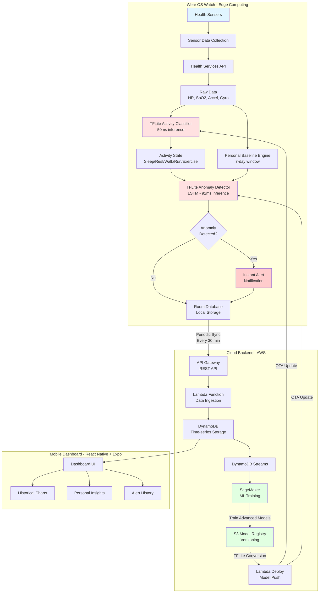
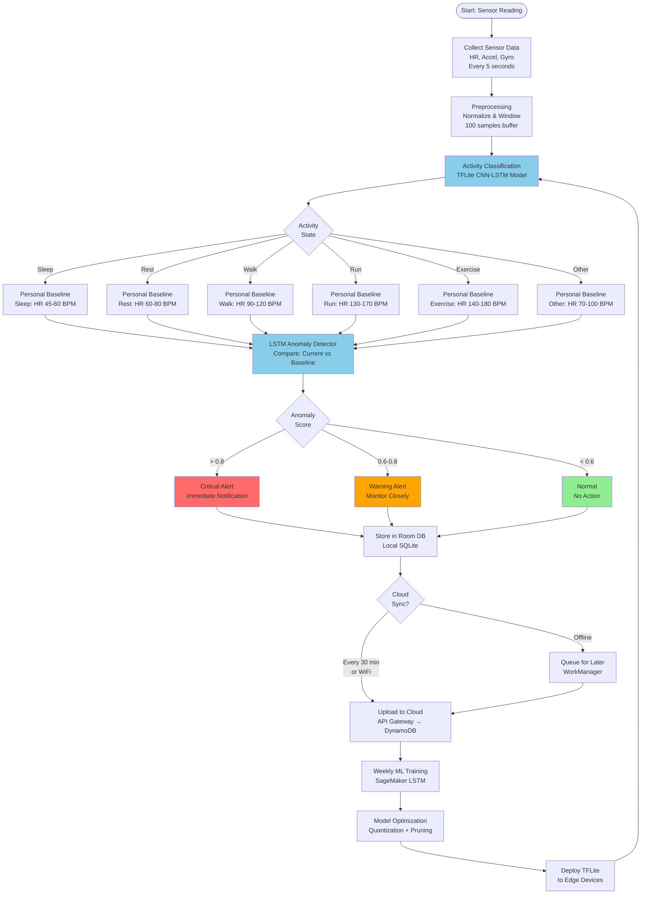
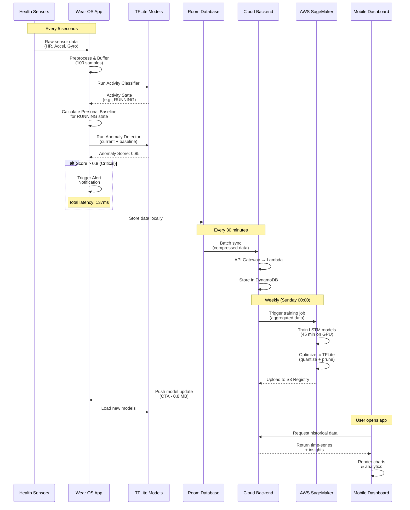
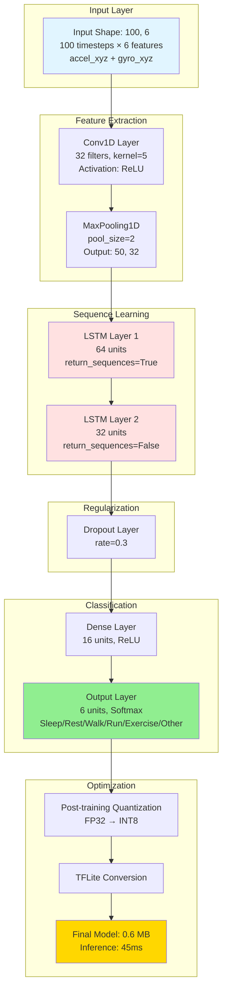
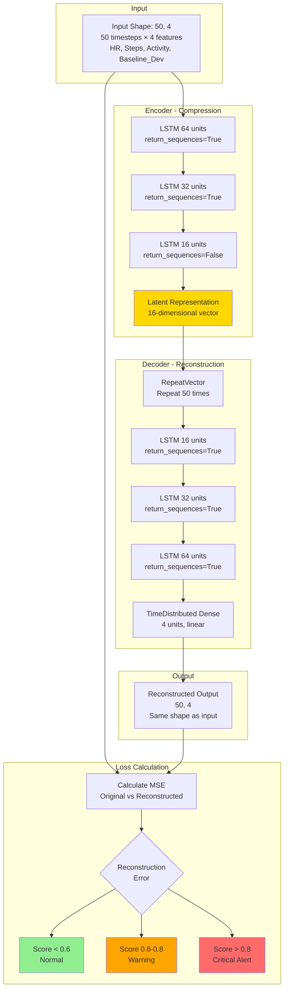
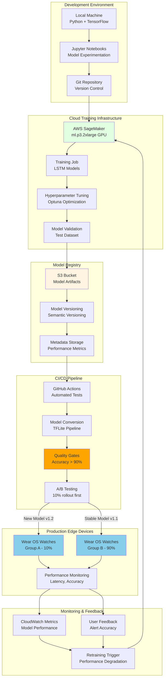
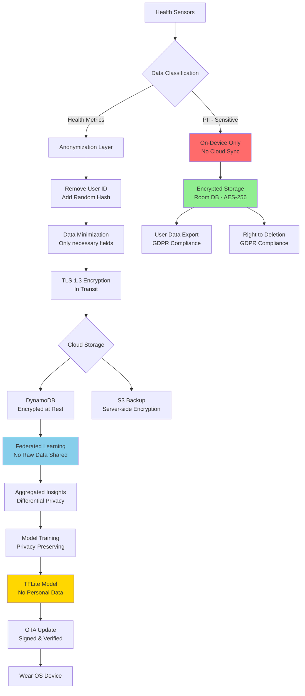

# Architecture Diagrams - Mermaid.js Code

## Diagram 1: Overall System Architecture (Hybrid Edge-Cloud)

---

## Diagram 2: Data Flow Architecture

---

## Diagram 3: ML Pipeline Architecture

```mermaid
graph LR
    subgraph "Data Collection Layer"
        A1[Wear OS Sensors] --> A2[Raw Data Stream]
        A2 --> A3[Local Preprocessing]
        A3 --> A4[Room Database]
    end
    
    subgraph "Edge ML Layer - TensorFlow Lite"
        B1[Activity Classifier<br/>CNN-LSTM]
        B2[Anomaly Detector<br/>LSTM Autoencoder]
        B3[Baseline Calculator<br/>Statistical Engine]
        
        A4 --> B1
        A4 --> B3
        B1 --> B2
        B3 --> B2
    end
    
    subgraph "Cloud Storage Layer"
        C1[API Gateway]
        C2[Lambda Ingestion]
        C3[DynamoDB<br/>Time-series Data]
        C4[S3<br/>Raw Data Archive]
        
        A4 -->|Periodic Sync| C1
        C1 --> C2
        C2 --> C3
        C2 --> C4
    end
    
    subgraph "Cloud ML Training Layer"
        D1[SageMaker Training<br/>GPU Instances]
        D2[LSTM Autoencoder<br/>Full Model]
        D3[Activity Classifier<br/>Deep CNN-LSTM]
        D4[Hyperparameter Tuning<br/>Optuna]
        
        C3 --> D1
        D1 --> D2
        D1 --> D3
        D1 --> D4
    end
    
    subgraph "Model Optimization Layer"
        E1[Post-training Quantization<br/>FP32 → INT8]
        E2[Weight Pruning<br/>60% sparsity]
        E3[Layer Fusion<br/>Operator Optimization]
        E4[TFLite Conversion]
        
        D2 --> E1
        D3 --> E1
        E1 --> E2
        E2 --> E3
        E3 --> E4
    end
    
    subgraph "Model Deployment Layer"
        F1[Model Registry<br/>S3 + Versioning]
        F2[A/B Testing<br/>Gradual Rollout]
        F3[OTA Update<br/>Push to Devices]
        
        E4 --> F1
        F1 --> F2
        F2 --> F3
        F3 --> B1
        F3 --> B2
    end
    
    subgraph "Analytics Layer"
        G1[Dashboard API]
        G2[React Native Mobile App]
        G3[Web Dashboard]
        
        C3 --> G1
        G1 --> G2
        G1 --> G3
    end
    
    style B1 fill:#ffe1e1
    style B2 fill:#ffe1e1
    style D1 fill:#e1ffe1
    style E4 fill:#fff3e1
    style F3 fill:#e1e1ff
```

---

## Diagram 4: Component Interaction Sequence

---

## Diagram 5: ML Model Architecture - Activity Classifier

---

## Diagram 6: ML Model Architecture - LSTM Autoencoder

---

## Diagram 7: Deployment Architecture

---

## Diagram 8: Data Privacy & Security Flow

---

## Usage Instructions

### How to Use These Diagrams:

1. **In Markdown/GitHub**: 
   - Copy the code blocks directly into your `.md` files
   - GitHub will automatically render Mermaid diagrams

2. **In Documentation Tools**:
   - Paste into tools that support Mermaid (GitBook, Notion, etc.)

3. **Convert to Images**:
   - Use Mermaid Live Editor: https://mermaid.live/
   - Copy code → Export as PNG/SVG

4. **In Presentations**:
   - Generate images from Mermaid Live Editor
   - Insert into PowerPoint/Google Slides

5. **In VS Code**:
   - Install "Markdown Preview Mermaid Support" extension
   - Preview diagrams directly in editor

### Customization Tips:

- **Change colors**: Modify `style` statements at the end of diagrams
- **Adjust layout**: Change `graph TB` (top-bottom) to `graph LR` (left-right)
- **Add notes**: Use `Note over Component: Your text here`
- **Styling**: Use `fill:#color` for backgrounds, `stroke:#color` for borders

### Color Scheme Used:

- `#e1f5ff` - Light blue (Sensors/Input)
- `#ffe1e1` - Light red (ML Models/Processing)
- `#e1ffe1` - Light green (Cloud/Training)
- `#fff3e1` - Light orange (Storage/Registry)
- `#e1e1ff` - Light purple (Deployment)
- `#ffd700` - Gold (Important/Optimized)
- `#ff6b6b` - Red (Alerts/Critical)
- `#90ee90` - Green (Success/Normal)
- `#ffa500` - Orange (Warning)
- `#87ceeb` - Sky blue (Edge Computing)
